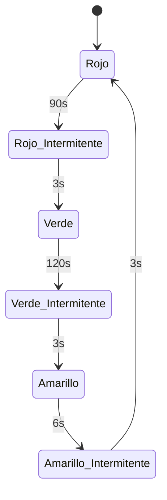

# 🚦 Sistema de Semáforos Inteligentes
**Trabajo Práctico Integrador 2026**

Este repositorio contiene el código fuente y la documentación del núcleo lógico para un sistema embebido de control de tráfico urbano. El proyecto está construido bajo el rigor del **paradigma de programación funcional**, garantizando inmutabilidad absoluta y la implementación de funciones puras.

## 📋 Descripción del Proyecto

El sistema modela una máquina de estados finitos que controla las transiciones de un semáforo (Rojo, Amarillo, Verde) e incluye intermitencias de seguridad. El ciclo completo está calculado matemáticamente para durar **225 segundos**, distribuyendo los tiempos de cada estado mediante evaluaciones lógicas puras.

El proyecto está desarrollado principalmente en **Common Lisp**, e incluye un estudio comparativo de estructuras lógicas implementado en **Erlang**.

## 🗂️ Estructura y Fases del Desarrollo

* **Fases 1 y 2 (Common Lisp): El problema de los 3 focos**
  * **Máquina de Estados:** Función `transicion` que dicta el flujo determinista entre colores principales e intermitentes.
  * **Lógica Temporal:** Función `timer` y cálculos de `duracion-ciclo`, `ciclos-por-tiempo` y `distribucion-porcentual`.
  * **Extensión 1 (Intermitencias):** Incorporación de pasos intermedios de 3 segundos entre las transiciones principales.
  * **Extensión 2 (Persistencia):** Sistema de *logging* impuro aislado para registrar los cambios de estado en `informe-ejecucion-semaforo.txt`.

* **Fase 3: Estudio Comparativo (Erlang)**
  * Reimplementación de las funciones `timer` y `transicion` para analizar y contrastar el recableado de la máquina de estados, el manejo de la evaluación condicional matemática, el *pattern matching* y las diferencias sintácticas (símbolos vs. átomos).

## 👥 Equipo de Desarrollo

* **[Fabio Javier Fernández]** 
* **[Gabriel Esquivel]**
* **[Gabriel Fava]**
* **[William Francisco Cantero]**

## ⚖️ Código de Honor y Declaración Jurada

Al alojar este código en el presente repositorio, el equipo declara bajo compromiso de honor que el desarrollo refleja fielmente la participación equitativa de sus miembros y la naturaleza original del trabajo. Se certifica la correcta clasificación de las funciones (Naturaleza, Estrategia e Impacto) en los comentarios del código.

## 🔗 Enlaces de Interés

* [▶️ Demostración del Sistema (Video en YouTube)]([https://youtu.be/ri8m7FIjv64])